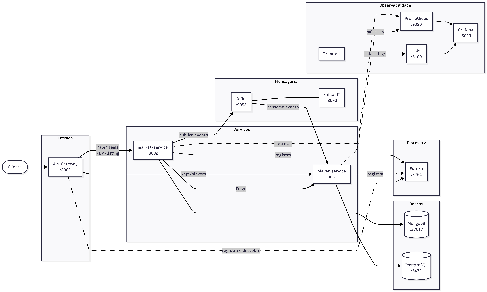

# Market Guild

## Descrição do Projeto
Market Guild é um projeto que busca simular o mercado de um jogo como Tibia. Usando tecnologias como PostgreSQL e MongoDB para armazenamento dos dados de jogadores e itens do mercado respectivamente, Spring Boot para o desenvolvimento dos microsserviços que são o coração da aplicação, e muitas outras ferramentas para simular o mercado.

## Arquitetura
A solução é composta por microsserviços independentes com bancos de dados separados, comunicação síncrona via Feign (protegida por circuit breaker) e assíncrona via Kafka, e uma camada completa de observabilidade com métricas, logs e tracing distribuído.



## Lista dos Serviços
| Serviço | Responsabilidade | Porta exposta no host |
|---|---|---|
| eureka-server | Discovery server dos serviços | 8761 |
| api-gateway | Ponto único de entrada da rede (reativo/WebFlux) | 8080 |
| player-service | Microsserviço responsável pelo usuário/player | 8081 |
| market-service | Microsserviço responsável pelo controle do mercado | 8082 |
| postgres | Banco de dados relacional para o player-service | Não exposta (apenas rede interna) |
| mongodb | Banco de dados não relacional para o market-service | Não exposta (apenas rede interna) |
| kafka | Broker de mensagens para comunicação assíncrona | Não exposta (apenas rede interna) |
| kafka-ui | Interface visual para monitorar tópicos Kafka | 8090 |
| prometheus | Coleta de métricas dos serviços | 9090 |
| loki | Agregador de logs | Não exposta (apenas rede interna) |
| promtail | Agente de coleta de logs dos containers | - |
| tempo | Armazenamento e consulta de traces distribuídos | Não exposta (apenas rede interna) |
| grafana | Visualização de métricas, logs e traces | 3000 |

## Tecnologias Utilizadas
- Spring Boot
- Eureka
- API Gateway (reativo)
- Apache Kafka
- OpenFeign
- Resilience4j (Circuit Breaker, via `CircuitBreakerFactory`)
- PostgreSQL
- MongoDB
- JPA / Hibernate
- Docker / Docker Compose
- Prometheus + Grafana (métricas)
- Loki + Promtail (logs)
- OpenTelemetry + Grafana Tempo (tracing distribuído)
- Correlation ID manual (rastreamento entre serviços, complementar ao tracing)

## Fluxo de Compra
1. Vendedor cria um item via `POST /api/items`
2. Vendedor lista o item no mercado via `POST /api/listing` com preço e ID do item
3. Comprador consulta os itens disponíveis via `GET /api/listing/active`
4. Comprador realiza a compra via `POST /api/listing/buy`
5. `market-service` busca os dados do comprador via Feign (protegido por circuit breaker) e valida localmente se o saldo é suficiente
6. Evento `ItemBoughtEvent` é publicado no Kafka (assíncrono)
7. A listagem é removida do mercado
8. `player-service` consome o evento, debita o saldo (internamente, via chamada direta ao PlayerService) e adiciona o item na bag do comprador

## Resiliência

### Circuit Breaker
A chamada de `market-service` para `player-service` via Feign é protegida por um circuit breaker explícito (Resilience4j, via `CircuitBreakerFactory`), implementado em `PlayerClientService`. Se o `player-service` estiver indisponível, o circuito abre após o limiar de falhas e o fallback retorna `503 Service Unavailable` imediatamente, sem nova tentativa de conexão.

## Observabilidade

### Correlation ID
O API Gateway gera um `X-Correlation-ID` único para cada requisição. Esse ID é propagado via header HTTP (Feign) e via payload do evento Kafka, aparecendo em todos os logs de todos os serviços. Isso permite rastrear uma operação completa, síncrona e assíncrona, por um único identificador.

### Métricas
O Spring Boot Actuator expõe métricas em `/actuator/prometheus`. O Prometheus coleta essas métricas a cada 15 segundos. O Grafana visualiza as métricas.

### Logs
O Promtail coleta automaticamente os logs de todos os containers Docker e os envia para o Loki. O Grafana permite filtrar logs por serviço e por Correlation ID.

**Exemplo de busca no Grafana:**
```
{container=~"market-guild-player-service-1|market-guild-market-service-1"} |= "seu-correlation-id"
```

### Tracing distribuído
O OpenTelemetry instrumenta automaticamente as chamadas HTTP entre os serviços e, via Micrometer Observation, também o fluxo assíncrono pelo Kafka (produção e consumo do `ItemBoughtEvent`). Os traces são exportados para o Grafana Tempo e consultados no Grafana, com link direto para os logs correspondentes no Loki.

## Como Executar o Projeto
1. Faça o download do projeto
2. Abra o Docker Desktop
3. Compile cada microsserviço antes de subir os containers, gerando o `.jar` necessário para o build das imagens:
```bash
cd player-service
./mvnw clean package -DskipTests
cd ../market-service
./mvnw clean package -DskipTests
cd ../api-gateway
./mvnw clean package -DskipTests
cd ../eureka-server
./mvnw clean package -DskipTests
cd ..
```
4. Abra um terminal e aponte para o diretório do projeto:
```bash
cd \market-guild
```
5. Execute o comando:
```bash
docker-compose up --build
```
6. Aguarde todos os containers subirem.

## Portas Utilizadas
| Serviço | Porta no host |
|---|---|
| Eureka | 8761 |
| API Gateway | 8080 |
| player-service | 8081 |
| market-service | 8082 |
| Kafka UI | 8090 |
| Prometheus | 9090 |
| Grafana | 3000 |

## Exemplos de Endpoints

### player-service
| Método | Endpoint | Descrição |
|---|---|---|
| POST | /api/players | Criar um player |
| GET | /api/players/{id} | Buscar um player pelo ID (inclui bag) |

> O endpoint `PATCH /internal/players/{id}/balance` existe apenas para fins de teste e desenvolvimento local. Ele **não é exposto pelo API Gateway** propositalmente, evitando que qualquer cliente externo possa alterar o saldo de um player diretamente. No fluxo real de produção, o saldo é debitado exclusivamente pelo consumer do Kafka (`ItemBoughtConsumer`), que chama o `PlayerService` diretamente dentro do próprio serviço, sem passar por nenhum endpoint HTTP.

### market-service - Items
| Método | Endpoint | Descrição |
|---|---|---|
| POST | /api/items | Criar um item |
| GET | /api/items/{itemId} | Buscar um item pelo ID |
| GET | /api/items/list | Listar todos os itens |

### market-service - Listagens
| Método | Endpoint | Descrição |
|---|---|---|
| POST | /api/listing | Listar um item no mercado |
| GET | /api/listing/active | Ver todos os itens disponíveis no mercado |
| GET | /api/listing/active/{id} | Buscar uma listagem pelo ID |
| POST | /api/listing/buy | Comprar um item listado |

## Como Acessar os Serviços de Observabilidade
| Serviço | URL | Credenciais |
|---|---|---|
| Eureka | http://localhost:8761 | - |
| Kafka UI | http://localhost:8090 | - |
| Prometheus | http://localhost:9090 | - |
| Grafana | http://localhost:3000 | admin / admin |

## Como Testar as Rotas pelo API Gateway
Utilize a porta **8080** em todas as requisições. O Gateway redirecionará automaticamente para o serviço correto baseado no caminho da URL.

**Exemplo:**
```
http://localhost:8080/api/players  →  player-service
http://localhost:8080/api/items    →  market-service
http://localhost:8080/api/listing  →  market-service
```